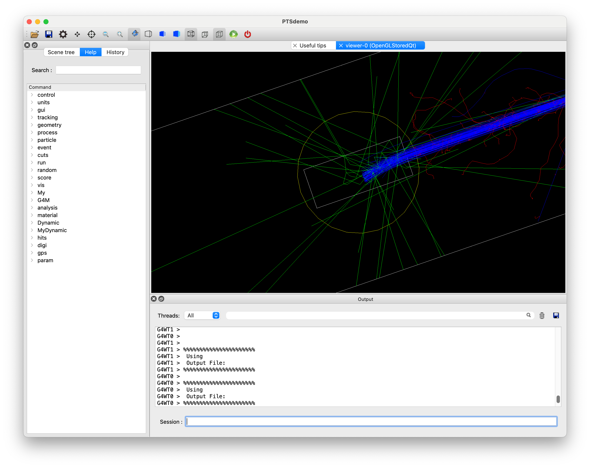

# Example A11(Layered-Mass w/ MagField）

静的な磁場モジュールの利用法を紹介します。例えば、MR-Linacのように照射対象に対して磁場を印加したい場合があります。
磁場モジュールとして`G4MBoxField`クラスと`G4MDiskField`クラスが用意されています。磁場はマスワールドに配置する必要があるので、磁場領域にかかる対象物はパラレルワールドのレイヤードマスジオメトリをして配置することになります。

ここでは、磁場モジュールを導入し、水ファントムが配置されている領域に磁場をかける例を紹介します。
 - 磁場モジュールの配置と設定
 - パラレルワールドの作成とレイヤードマスジオメトリの設定

以下、PTSIMの実行ディレクトリ(例: ~/PTSproject-install/PTSapps/DynamicPort)で作業します。

## 例題マクロファイル
PTSIMコードに付属するマクロファイル`exampleA11.mac`をコピーして用います。
```
$ cp  ./macros/tut/exampleA11.mac  .
```

実行
```
$ ./bin/PTSdemo  -i  exampleA11.mac
```


パラレルワールドも表示します。
```
Session: /vis/drawVolume worlds
```


陽子線を照射します。
```
Session: /vis/scene/add/trajectories
Session: /vis/scene/endOfEventAction accumulate
Session: /run/beamOn 100
```



終了
```
Session: exit
```

### マクロファイルの解説
解説するコマンド部分のみを抜粋して説明します。
このマクロファイルでは、実空間(Mass-world)の治療室に磁場モジュール(G4MDiskField)が置かれています。
また、パラレルワールドを作成し、磁場モジュールの領域内に含有するように水ファントムが配置され、レイヤードマスジオメトリとして扱われるように設定がなされています。

```{code-block}
:linenos:
#
# (PreInit State)
/control/verbose 1
#
# Material
/control/execute ./macros/common/materials.mac
#
# PhysicsList
/control/execute ./macros/common/phys.mac
#
# System and module registration
/G4M/System DynamicPort
/Dynamic/Module/Room/register 525.  525.  3550. mm
/Dynamic/Module/WaterPhantom/register Phantom
/Dynamic/Module/register FieldDisk G4MDiskField ./data/Sample/G4MDisk/fielddisk.dat 0. 0. 0. mm
#
# Create Parallel World
/My/DetConstruction/createPW  paraWorld0
#
# Activate Parallel World Process w/ Layered Mass
/My/physics/pwProcess     paraWorld0  true
#
#
# Run Initialize
/run/initialize
#
# (PreInit State)
#
# Primary particle
/My/PrimaryGenerator/select GPS
/control/execute ./macros/common/gps.mac
#
# (Parallel-World) Layered-Mass Geometry
/G4M/Module/Phantom/size   100. 100. 250.0 mm
/G4M/Module/Phantom/dim    100. 100. 250.
/G4M/Module/install  Phantom paraWorld0 true
#
# (Mass-World) Magnetic Field
/G4M/Module/select  FieldDisk
/G4M/Module/rotate  90. 0. 0. degree
/G4M/Module/install FieldDisk
# B-field value (Given in the world coordinate)
/G4M/Module/FieldDisk/field 0 1.5 0 tesla
#
#
# Scoring
/My/runaction/dumpfile      A11.root
/My/runaction/ntuple/merge  true
#
#
# Track analysis
/My/runaction/ntuple/create    NT Phantom/HitsCollection
/My/runaction/ntuple/addColumn NT pid  I
/My/runaction/ntuple/addColumn NT ix   I
/My/runaction/ntuple/addColumn NT iy   I
/My/runaction/ntuple/addColumn NT iz   I
/My/runaction/ntuple/addColumn NT de   F  keV
/My/runaction/ntuple/showScColumn NT
#
# BeamOn
#/run/beamOn 100
#
```

#### 磁場モジュールを登録する
磁場モジュールには、`G4MBoxField`と`G4MDiskField`があります。今回は`G4MDiskField`を例に説明します。
```
PreInit> /Dynamic/Module/register FieldDisk G4MDiskField ./data/Sample/G4MDisk/fielddisk.dat
```
パラメタファイル`fielddisk.dat`の内容は、次のようになっています。

```{code-block}
:linenos:
000
60. cm thick Magnetic field
600.
300.0
G4_AIR
0.00
```
ジオメトリ構築に使われるのは、３〜６行目のみです。３行目で円筒形の半径\(mm\)を、４行目でZ軸方向の半長さ\(mm\)を指定しています。5行目は物質名です。6行目は磁場値\(tesla\)ですが、後ほどコマンドでも変更が可能です。

ちなみに、`G4MBoxField`の場合は、次のように置き換わります。
```
PreInit> /Dynamic/Module/register FieldBox G4MBoxField ./data/Sample/G4MBox/fieldbox.dat
```
パラメタファイル`fieldbox.dat`の内容
```{code-block}
:linenos:
000
70. cm Magnetic field.
700.   700.  700.
G4_AIR
0.00
```
ジオメトリ構築に使われるのは、３〜５行目のみです。３行目で四角柱のX,Y,Z軸方向の半長\(mm\)を、４行目で物質名、6行目で磁場値\(tesla\)です。磁場値は後ほどコマンドでも変更が可能です。

#### 磁場モジュールの設定と配置
円柱形の磁場空間を想定します。作成した円柱系はZ軸方向に円形面が向いているので、X軸の周りに90度回転して配置します。
```
/G4M/Module/select  FiledDisk
/G4M/Module/rotate  90. 0. 0. degree
/G4M/Module/install FieldDisk
```
また、磁場を**ワールド座標系**のY軸方向に印加します。
```
/G4M/Module/FieldDisk/field 0 1.5 0 tesla
```
これで磁場が印加されます。

### 水ファントムをParallel Worldに配置する
先のチュートリアルで解説した内容と同じ手順ですが、水ファントムの場合を改めて手順を説明します。

#### パラレルワールドを作成する
パラレルワールドの作成は、以下のようにパラレルワールドにつける固有名を引数にコマンドを実行します。
```
PreInit> /My/DetConstruction/createPW  paraWorld0 
```

#### Parallel World用のプロセスを有効化
粒子をトラッキングする際にパラレルワールドを参照するように、専用のプロセスを追加します。

パラレルワールド・スコアリングと異なるのは２番目の引数で、Layered-Mass用であるフラグをtrueに設定するところです。
```
PreInit> /My/physics/pwProcess     paraWorld0   true
```
１番目の引数がパラレルワールドの固有名です。２番目の引数はパラレルワールドの物質を利用するかどうかを指定します。
Layerd-Massでは、このフラグを`true`に設定します。これにより、パラレルワールドに配置したボリュームの物質を優先的に参照してシミュレーションが行われます。パラレルワールドの物質が`null`であった場合は、通常通りにMass-Worldの物質が参照されます。

#### パラレルワールドでのジオメトリ構築

ジオメトリそのものは、通常のビームモジュールの扱いと一部を除き同じです。

- コリメータのビームモジュール登録
```
PreInit> /Dynamic/Module/WaterPhantom/register  Phantom
```

- 水ファントムをパラレルワールドにLayered-Massジオメトリとして実体化
```
Idle> /G4M/Module/install  Phantom  paraWorld0  true
```

`/G4M/Module/install`コマンドを使って実体化します。１番目の引数はモジュール名、２番目の引数はパラレルワールドの固有名、３番目のフラグがLayered-Massのジオメトリとして実体化することを表します。

#### スコアリング結果例
```
$ root A11.root
root[] .ls
root[] NT->Print()
root[] NT->Draw("ix:iz","de","colz")
root[] .q
```


以上

