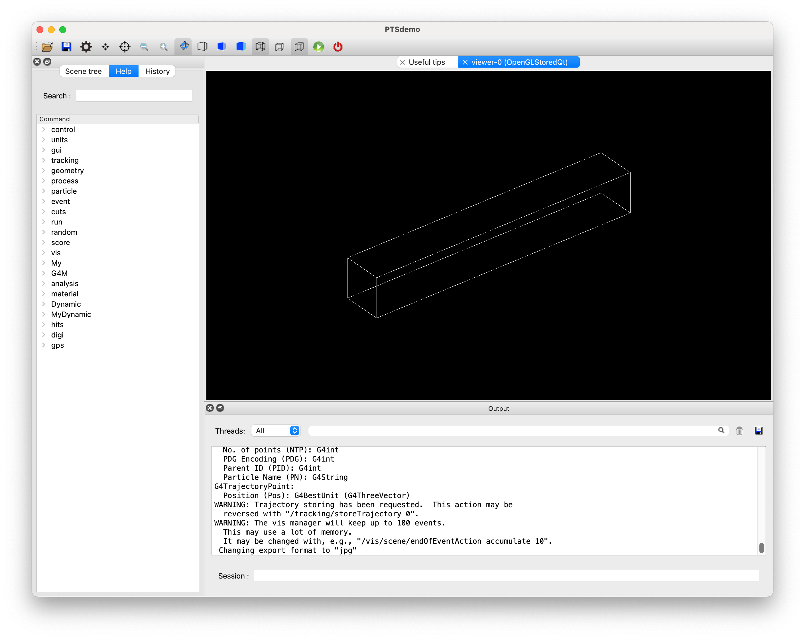

# Example A6(ParallelWorld-Score）

Geant4では通常は、ジオメトリのオーバラップが許されませんが、実体が置かれたシミュレーション空間と並列するパラレルワールドを用いることで、自由なスコアリング領域を定義することが可能です。

ここでは、パラレルワールドの作成方法とスコアリングへの適用方法を解説します。

**パラレルワールド・スコアリング**
 - パラレルワールドの作成
 - パラレルワールド用スコアリングプロセスの有効化
 - パラレルワールドでのスコアリングジオメトリ構築
 - スコア方法

以下、PTSIMの実行ディレクトリ(例: ~/PTSproject-install/PTSapps/DynamicPort)で作業します。

## 例題マクロファイル
PTSIMコードに付属するマクロファイル`exampleA6.mac`をコピーして用います。
```
$ cp  ./macros/tut/exampleA6.mac  .
```

実行
```
$ ./bin/PTSdemo  -i  exampleA6.mac
```

簡素設定のために、治療室のみの体系となっていますが、治療室にビーム機器などが配置されていてもパラレルワールドのスコアリングは問題なく機能します。



この状態ではパラレルワールドのボリュームが見えていない状態です。
パラレルワールドのスコアリングボリュームを可視化します。
```
Session: /vis/drawVolume  worlds
```
`/vis/drawVolume`コマンドの引数を`worlds`とすると、パラレルワールドのボリュームも表示できます。
下記の表示では、治療室に板上のジオメトリが配置されています。可視化をスキップしていますが、この板は格子状に切り分けられており、セルでの粒子情報をスコアできるようになっています。


終了
```
Session: exit
```
### マクロファイルの解説
解説するコマンド部分のみを抜粋して説明します。
このマクロファイルでは、実空間(Mass-world)は治療室のみで、パラレルワールドに水ファントムのビームモジュールをスコアリングボリュームとして配置します。水ファントムの物質は無視されてスコアリングのみに用いられます。

```{code-block}
:linenos:
#
# (PreInit State)
#
# Material
/control/execute ./macros/common/materials.mac
#
# PhysicsList
/control/execute ./macros/common/phys.mac
#
# System and module registration
/G4M/System DynamicPort
/Dynamic/Module/Room/register 525.  525.  3550. mm
/Dynamic/Module/WaterPhantom/register Phantom
#
# Create Parallel World
/My/DetConstruction/createPW  paraWorld0
#
# Activate Parallel World Process
/My/physics/pwProcess     paraWorld0   false
#
#
# Run Initialize
/run/initialize
#
# (PreInit State)
#
# Primary particle
/My/PrimaryGenerator/select GPS
/control/execute ./macros/common/gps.mac
#
# Scoring volume using WaterPhantom
/G4M/Module/Phantom/size   500. 100. 3550.0 mm
/G4M/Module/Phantom/dim    100.   1.  710.
/G4M/Module/Phantom/material G4_AIR
#
# Install in the ParallelWorld
/G4M/Module/install  Phantom  paraWorld0
#
# Scoring
/My/runaction/dumpfile      A6.root
/My/runaction/ntuple/merge  true
#
# Track analysis
/My/runaction/ntuple/create    NT Phantom/HitsCollection 
/My/runaction/ntuple/addColumn NT pid  I
/My/runaction/ntuple/addColumn NT ix   I
/My/runaction/ntuple/addColumn NT iz   I
/My/runaction/ntuple/addColumn NT de   F  keV
/My/runaction/ntuple/showScColumn NT
#
# BeamOn
#/run/beamOn 100
#
```

#### Parallel Worldを作成する

パラレルワールドの作成は、以下のようにパラレルワールドにつける固有名を引数にコマンドを実行します。
```
PreInit> /My/DetConstruction/createPW  paraWorld0
```
この例では、固有名は*paraWorld0*となります。複数のパラレルワールドを作成することができ、後に作成したものが呼び出し時に優先されます。複数のパラレルワールドを作成すると、粒子追跡の観点からパフォーマンスが低下しますので利用する際には検討が必要です。

#### Parallel World用のプロセスを有効化
粒子をトラッキングする際にパラレルワールドを参照するように、専用のプロセスを追加します。
```
PreInit> /My/physics/pwProcess     paraWorld0   false
```
１番目の引数がパラレルワールドの固有名です。２番目の引数はパラレルワールドの物質を利用するかどうかを指定します。スコアリング用であれば、物質は不要であるので`false`にします。

#### パラレルワールドでのスコアリングジオメトリ構築

ジオメトリそのものは、通常のビームモジュールの扱いと変わりません。今回は、水ファントムのビームモジュールを用います。

- 水ファントムビームモジュールの登録
```
PreInit> /Dynamic/Module/WaterPhantom/register Phantom
```

- 水ファントムの設定
```
Idle> /G4M/Module/Phantom/size   500. 100. 3550.0 mm
Idle> /G4M/Module/Phantom/dim    100.   1.  710.
/G4M/Module/Phantom/material G4_AIR
```
これらは通常の水ファントム設定と同じ手順です。

- パラレルワールドへの実体化
設定した水ファントムのジオメトリを、パラレルワールドで実体化します。
```
Idle> /G4M/Module/install  Phantom  paraWorld0
```
１番目の引数が、配置するビームモジュール名`Phantom`、２番目の引数がパラレルワールドの固有名`paraWorld0`です。
通常の`install`コマンドとの違いは、パラレルワールドの固有名を指定するところだけです。

- スコアリング
スコアリングに関するコマンド部分は、通常の手順と全く同じです。
```
/My/runaction/dumpfile      A6.root
/My/runaction/ntuple/merge  true
#
/My/runaction/ntuple/create    NT Phantom/HitsCollection 
/My/runaction/ntuple/addColumn NT pid  I
/My/runaction/ntuple/addColumn NT ix   I
/My/runaction/ntuple/addColumn NT iz   I
/My/runaction/ntuple/addColumn NT de   F  keV
/My/runaction/ntuple/showScColumn NT
#
```

`/run/beamOn 10000`の結果の例を示します。
```
$ root A6.root
root[] NT->Draw("ix:iz","de","colz")
```


以上


